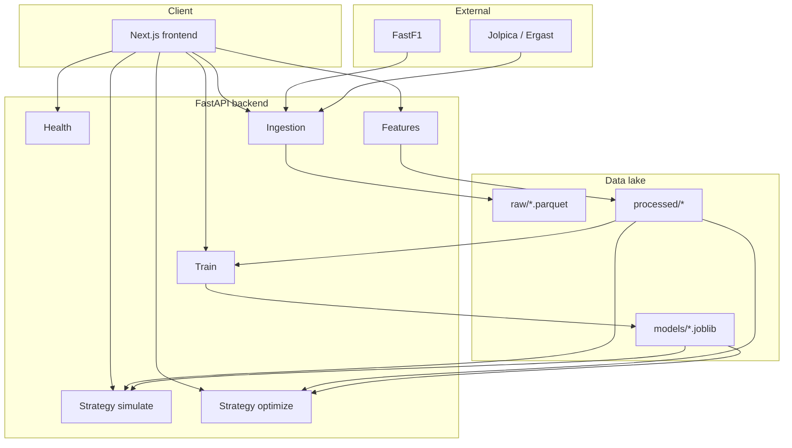

# Architecture (current)

## High-level

## Data flow

1. **Ingestion** loads schedule (FastF1) and results (HTTP APIs), optional lap extraction → `data/raw/`.
2. **Feature build** joins laps with results, engineers columns → `data/processed/lap_features_*.parquet`.
3. **Training** fits XGBoost pipeline → `data/processed/models/`.
4. **Strategy** endpoints read features + model; simulate compares two pit plans; optimize searches candidates with Monte Carlo scoring.

## Deployment

- **Docker Compose**: `backend` (Python + Uvicorn), `frontend` (Node dev server); backend may use NVIDIA GPU via `deploy.resources.reservations.devices`.
- **Host**: Python venv + `pip install -r backend/requirements.txt`; Node + `npm ci` in `frontend/` (use `package-lock.json`).

## Related docs

- [portfolio.md](portfolio.md) — narrative and interview talking points  
- [phase_report.md](phase_report.md) — phased delivery report  
