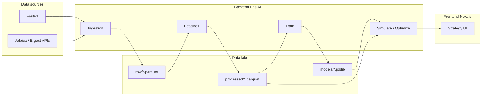

# F1 Strategy Intelligence Platform — Portfolio Narrative

Use this page for resumes, interviews, and GitHub project descriptions.  
For technical depth, see [phase_report.md](phase_report.md) and [architecture.md](architecture.md).

---

## Elevator pitch (30 seconds)

I built an **end-to-end Formula 1 strategy analytics platform**: it ingests race data (FastF1 + public results APIs), engineers lap-level features, trains a **GPU-accelerated XGBoost** model for lap-time prediction, and exposes **counterfactual pit strategy** simulation plus **multi-stop optimization** with Monte Carlo uncertainty and explainability signals — all behind a **FastAPI** backend and **Next.js** frontend, runnable locally or in **Docker** with NVIDIA GPU support.

---

## Recruiter-friendly bullets

- **Data**: Season schedules, race results, lap-level race data → Parquet data lake.
- **ML**: Next-lap-time baseline model (scikit-learn + XGBoost); optional CUDA training in containers.
- **Product**: REST APIs for ingestion, features, training, strategy simulation, and strategy optimization.
- **Engineering**: Typed schemas (Pydantic), reproducible `requirements.full.txt`, optional `package-lock.json` for Node, verification script for imports.
- **Ops**: Docker Compose with GPU passthrough for backend training on consumer NVIDIA GPUs (e.g. RTX 3080).

---

## Architecture (high level)

---

## Representative benchmarks (illustrative)

Values depend on season, hardware, and network; treat as **order-of-magnitude** from development runs.

| Stage | Metric | Typical range / note |
|-------|--------|----------------------|
| Lap feature table | Row count (2024) | ~25k+ laps |
| Baseline model | Test RMSE (seconds) | ~2.5–2.7s next-lap |
| Strategy simulate | Latency | Sub-second after warmup |
| Strategy optimize | Latency | ~10–15s with MC samples (tunable) |
| Docker + GPU | Training `used_gpu` | `true` when `nvidia-smi` visible in container |

---

## Interview talking points

1. **Why Parquet?** Columnar storage, fast for analytics, works well with pandas/pyarrow and ML pipelines.
2. **Why separate simulate vs optimize?** Simulate answers “what if I pit on lap X?”; optimize searches a constrained space of strategies with scoring.
3. **Uncertainty:** Monte Carlo noise on predicted race time + analytic bounds on deltas where applicable.
4. **Limitations:** Heuristic position gain; not a full multi-car agent-based sim; rules/regulations not encoded.

---

## How to describe your role

> I owned the data pipeline from ingestion to model artifacts, designed the strategy simulation and optimization APIs, integrated GPU training in Docker, and shipped a minimal but real product UI — with documentation and a verification script so reviewers can reproduce the environment.

---

## Links in repo

| Document | Purpose |
|----------|---------|
| `README.md` | Setup, API list, Docker, GPU |
| `docs/phase_report.md` | Phased implementation report |
| `docs/architecture.md` | System overview |
| `scripts/verify_environment.py` | Import + `pip check` (no broken Python deps) |

## Dependency audit note

- **Python**: `verify_environment.py` + `pip check` — use after every `pip install -r backend/requirements.full.txt`.
- **Node**: `frontend/package-lock.json` locks versions; `npm ci` for clean installs. `npm audit` may report Next.js advisories that **require a major version bump**; plan upgrades in a separate branch after regression testing.
